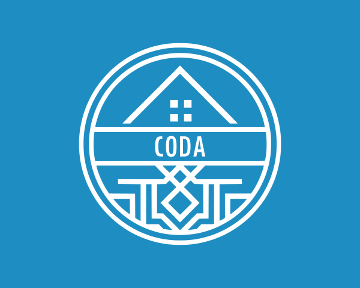
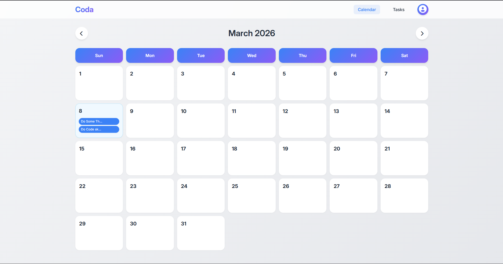
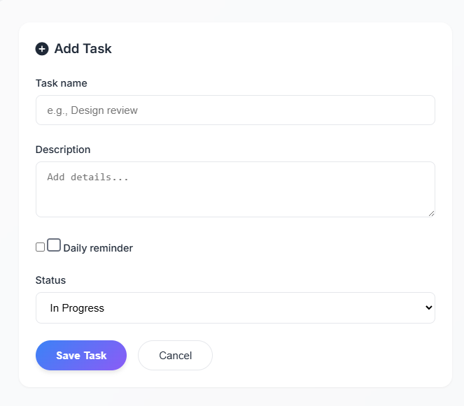
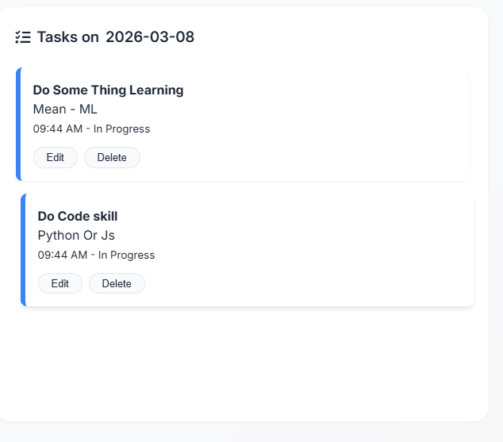

<div align="center">

# 📅 CODA  
### *Where calendar meets tasks — beautifully.*

<!-- BADGES WITH ICONS -->
<p>
  <a href="https://nodejs.org/"></a>
  <a href="https://expressjs.com/"></a>
  <a href="https://www.mongodb.com/cloud/atlas"></a>
  <a href="https://opensource.org/licenses/MIT"></a>
  <a href="#contributing"></a>
</p>

<!-- HERO CARD WITH GLASS EFFECT -->
<div style="display: inline-block; border-radius: 32px; padding: 8px; background: linear-gradient(145deg, #4f46e5, #7e22ce); box-shadow: 0 30px 50px rgba(79,70,229,0.3); margin: 2rem auto; transition: transform 0.2s ease-in-out;" onmouseover="this.style.transform='scale(1.02)'" onmouseout="this.style.transform='scale(1)'">
  <div style="background: #ffffff; border-radius: 24px; padding: 1.5rem;">
    
  </div>
</div>
<p style="font-size: 1.2rem; color: #334155;"><em>⚡ Visualize and manage your tasks directly from the calendar</em></p>

</div>

---

## 📖 Overview

**Coda** is a full‑stack productivity web application that fuses a **calendar** with a **smart todo list**.  
Create, edit, and delete tasks on specific dates, track progress (In Progress / Done), and set daily or weekday reminders.  
Built with **Node.js**, **Express**, **MongoDB Atlas**, and vanilla **HTML/CSS/JavaScript** – it offers a sleek, modern interface with toast notifications instead of browser alerts.

---

## ✨ Key Features

<div style="display: flex; flex-wrap: wrap; gap: 1.8rem; justify-content: center; margin: 3rem 0;">

<!-- FEATURE CARD -->
<div style="flex: 1 1 280px; background: #ffffff; border-radius: 2rem; padding: 2rem 1.5rem; box-shadow: 0 15px 35px -10px rgba(0,0,0,0.1); border: 1px solid #eef2f6; transition: all 0.2s;">
  <div style="font-size: 3rem; text-align: center;">📆</div>
  <h3 style="font-size: 1.8rem; margin: 1rem 0 0.5rem; text-align: center;">Calendar View</h3>
  <p style="color: #475569; text-align: center;">Interactive monthly calendar – switch months, click any date to add tasks instantly.</p>
</div>

<div style="flex: 1 1 280px; background: #ffffff; border-radius: 2rem; padding: 2rem 1.5rem; box-shadow: 0 15px 35px -10px rgba(0,0,0,0.1); border: 1px solid #eef2f6;">
  <div style="font-size: 3rem; text-align: center;">✅</div>
  <h3 style="font-size: 1.8rem; margin: 1rem 0 0.5rem; text-align: center;">Full Task Control</h3>
  <p style="color: #475569; text-align: center;">Add name, description, status. Edit or delete anytime. Everything syncs in real time.</p>
</div>

<div style="flex: 1 1 280px; background: #ffffff; border-radius: 2rem; padding: 2rem 1.5rem; box-shadow: 0 15px 35px -10px rgba(0,0,0,0.1); border: 1px solid #eef2f6;">
  <div style="font-size: 3rem; text-align: center;">🔁</div>
  <h3 style="font-size: 1.8rem; margin: 1rem 0 0.5rem; text-align: center;">Smart Reminders</h3>
  <p style="color: #475569; text-align: center;">Repeat tasks daily or on selected weekdays. Never miss a habit or deadline.</p>
</div>

<div style="flex: 1 1 280px; background: #ffffff; border-radius: 2rem; padding: 2rem 1.5rem; box-shadow: 0 15px 35px -10px rgba(0,0,0,0.1); border: 1px solid #eef2f6;">
  <div style="font-size: 3rem; text-align: center;">🔐</div>
  <h3 style="font-size: 1.8rem; margin: 1rem 0 0.5rem; text-align: center;">Secure Authentication</h3>
  <p style="color: #475569; text-align: center;">Sign up / log in with bcrypt‑hashed passwords. Sessions managed via express‑session.</p>
</div>

<div style="flex: 1 1 280px; background: #ffffff; border-radius: 2rem; padding: 2rem 1.5rem; box-shadow: 0 15px 35px -10px rgba(0,0,0,0.1); border: 1px solid #eef2f6;">
  <div style="font-size: 3rem; text-align: center;">🧩</div>
  <h3 style="font-size: 1.8rem; margin: 1rem 0 0.5rem; text-align: center;">Modern UI/UX</h3>
  <p style="color: #475569; text-align: center;">Glassmorphism, smooth interactions, fully responsive. Toast notifications replace old‑school alerts.</p>
</div>

<div style="flex: 1 1 280px; background: #ffffff; border-radius: 2rem; padding: 2rem 1.5rem; box-shadow: 0 15px 35px -10px rgba(0,0,0,0.1); border: 1px solid #eef2f6;">
  <div style="font-size: 3rem; text-align: center;">📋</div>
  <h3 style="font-size: 1.8rem; margin: 1rem 0 0.5rem; text-align: center;">Task List View</h3>
  <p style="color: #475569; text-align: center;">See all tasks sorted by date (newest/oldest). Filter and manage with ease.</p>
</div>

</div>

---

## ⚙️ Technology Stack

<div align="center" style="margin: 3rem 0; display: flex; flex-wrap: wrap; gap: 1.5rem; justify-content: center;">

<div style="background: #f8fafc; border-radius: 60px; padding: 0.8rem 2rem; box-shadow: 0 5px 15px rgba(0,0,0,0.03); display: inline-flex; align-items: center; gap: 15px;">
  
  
  
  <span style="font-weight: 600; font-size: 1.2rem;">Frontend</span>
</div>

<div style="background: #f8fafc; border-radius: 60px; padding: 0.8rem 2rem; box-shadow: 0 5px 15px rgba(0,0,0,0.03); display: inline-flex; align-items: center; gap: 15px;">
  
  
  <span style="font-weight: 600; font-size: 1.2rem;">Backend</span>
</div>

<div style="background: #f8fafc; border-radius: 60px; padding: 0.8rem 2rem; box-shadow: 0 5px 15px rgba(0,0,0,0.03); display: inline-flex; align-items: center; gap: 15px;">
  
  <span style="font-weight: 600; font-size: 1.2rem;">MongoDB Atlas</span>
</div>

<div style="background: #f8fafc; border-radius: 60px; padding: 0.8rem 2rem; box-shadow: 0 5px 15px rgba(0,0,0,0.03); display: inline-flex; align-items: center; gap: 15px;">
  <!-- Let's Encrypt icon (inline SVG) -->
  <svg role="img" viewBox="0 0 24 24" width="35" height="35" fill="#4A4A55" xmlns="http://www.w3.org/2000/svg">
    <title>Let's Encrypt</title>
    <path d="M11.9914 0a.8829.8829 0 00-.8718.817v3.0209A.8829.8829 0 0012 4.7207a.8829.8829 0 00.8803-.8803V.817a.8829.8829 0 00-.889-.817zm7.7048 3.1089a.8804.8804 0 00-.5214.1742l-2.374 1.9482a.8804.8804 0 00.5592 1.5622.8794.8794 0 00.5592-.2001l2.3714-1.9506a.8804.8804 0 00-.5944-1.534zm-15.3763.0133a.8829.8829 0 00-.611 1.5206l2.37 1.9506a.876.876 0 00.5606.2001v-.002a.8804.8804 0 00.5597-1.5602L4.8277 3.2831a.8829.8829 0 00-.5078-.161zm7.6598 3.2275a5.0456 5.0456 0 00-5.0262 5.0455v1.4876H5.787a.9672.9672 0 00-.9647.9643v9.1887a.9672.9672 0 00.9647.9643H18.213a.9672.9672 0 00.9643-.9643v-9.1907a.9672.9672 0 00-.9643-.9623h-1.1684v-1.4876a5.0456 5.0456 0 00-5.0649-5.0455zm.0127 2.8933a2.1522 2.1522 0 012.1593 2.1522v1.4876H9.8473v-1.4876a2.1522 2.1522 0 012.145-2.1522zm7.3812.5033a.8829.8829 0 10.0705 1.7632h3.0267a.8829.8829 0 000-1.7609H19.444a.8829.8829 0 00-.0705-.0023zm-17.8444.0023a.8829.8829 0 000 1.7609h2.9983a.8829.8829 0 000-1.7609zm10.4596 6.7746a1.2792 1.2792 0 01.641 2.3926v1.2453a.6298.6298 0 01-1.2595 0v-1.2453a1.2792 1.2792 0 01.6185-2.3926z"/>
  </svg>
  <span style="font-weight: 600; font-size: 1.2rem;">bcrypt + express-session</span>
</div>

</div>

---

## 🚀 Quick Start Guide

### Prerequisites

- [Node.js](https://nodejs.org/) (v14 or later)
- [MongoDB Atlas](https://www.mongodb.com/cloud/atlas) account (free tier)
- Git (optional)

### Installation

1. **Clone the repository**
   ```bash
   git clone https://github.com/yourusername/coda.git
   cd coda
   ```

2. **Install dependencies**
   ```bash
   npm install
   ```

3. **Set up environment variables**  
   Create a `.env` file in the root:
   ```env
   PORT=3000
   MONGODB_URI=mongodb+srv://<username>:<password>@cluster.mongodb.net/coda?retryWrites=true&w=majority
   SESSION_SECRET=your-strong-secret-key
   ```

4. **Configure MongoDB Atlas**  
   - Create a cluster and database user with read/write permissions.  
   - Add your IP to the network access list (or use `0.0.0.0/0` for development).  
   - Paste the connection string into `MONGODB_URI`.

5. **Run the application**
   ```bash
   npm start        # production
   # or
   npm run dev      # development with nodemon
   ```

6. Open [http://localhost:3000](http://localhost:3000) in your browser. 🎉

---

## 📁 Project Structure

```
coda/
├── .env
├── package.json
├── server.js
├── models/
│   ├── User.js
│   └── Task.js
├── middleware/
│   └── auth.js
├── routes/
│   ├── auth.js
│   └── tasks.js
└── public/
    ├── index.html
    ├── tasks.html
    ├── login.html
    ├── signup.html
    ├── css/
    │   └── style.css
    └── js/
        ├── auth.js
        ├── calendar.js
        └── tasks.js
```

---

## 📸 Screenshots

<div align="center" style="display: flex; flex-wrap: wrap; gap: 25px; justify-content: center; margin: 3rem 0;">

<div style="border-radius: 24px; overflow: hidden; box-shadow: 0 20px 30px rgba(0,0,0,0.1); width: 300px; background: white;">
  
  <div style="padding: 15px; text-align: center; font-weight: 600;">📆 Calendar View</div>
</div>

<div style="border-radius: 24px; overflow: hidden; box-shadow: 0 20px 30px rgba(0,0,0,0.1); width: 300px; background: white;">
  
  <div style="padding: 15px; text-align: center; font-weight: 600;">➕ Add Task Panel</div>
</div>

<div style="border-radius: 24px; overflow: hidden; box-shadow: 0 20px 30px rgba(0,0,0,0.1); width: 300px; background: white;">
  
  <div style="padding: 15px; text-align: center; font-weight: 600;">📋 Task List</div>
</div>

</div>

---

## 🔮 Roadmap & Future Enhancements

- [ ] Drag & drop tasks on calendar  
- [ ] Dark / light theme toggle  
- [ ] Email reminders via cron jobs  
- [ ] Share tasks / collaborative lists  
- [ ] Mobile app (React Native)  
- [ ] Integration with Google Calendar  

---

## 👤 Author

<div align="center" style="background: linear-gradient(145deg, #ffffff, #f9fafb); border-radius: 4rem; padding: 2.5rem; max-width: 500px; margin: 3rem auto; box-shadow: 0 20px 40px rgba(0,0,0,0.05);">

<div style="font-size: 4rem;">👨‍💻</div>
<h2 style="margin: 0.5rem 0 0;">Ramdas Hembram</h2>
<p style="color: #64748b;">Full‑stack developer & productivity enthusiast</p>

<p>
  <a href="https://github.com/ramdas-5"></a>
  <a href="https://linkedin.com/in/dev-raZmdas-"></a>
</p>

<p><em>Built with 💙 and assistance from DeepSeek AI</em></p>

</div>

---

## 🤝 Contributing

Contributions are what make the open‑source community such an amazing place to learn, inspire, and create. Any contributions you make are **greatly appreciated**.

1. Fork the Project  
2. Create your Feature Branch (`git checkout -b feature/AmazingFeature`)  
3. Commit your Changes (`git commit -m 'Add some AmazingFeature'`)  
4. Push to the Branch (`git push origin feature/AmazingFeature`)  
5. Open a Pull Request  

---

## 📄 License

Distributed under the **MIT License**. See `LICENSE` for more information.

---

<div align="center">
  <p style="font-size: 1.3rem;">Made with <span style="color: #e11d48;">❤️</span> by Ramdas Hembram</p>
  <p>⭐ Star this project if you found it useful!</p>
</div>